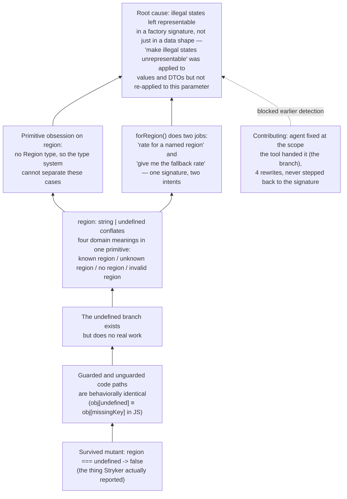

# Agent vs. mutants

> A field note from setting up Stryker for `src/shared/pricing/margins/margin.ts` (Task 3). Worth reading before
> anyone chases a mutation score to 100% for the first time.
>
> **Read the correction at the bottom first if you're short on time.** The mutant described below as "unkillable" was
> not unkillable — it was a modeling bug wearing a testing-tool costume, and it took someone asking "why can `region`
> be `undefined` at all" to see it. The four rewrite attempts and the 95%-threshold conclusion that follows are kept
> here because being wrong about this in a specific, traceable way is more useful to read than a version of this
> document that got it right the first time.

## What mutation testing actually gives you

Unit tests answer "does the code do what I wrote." Mutation testing answers a sharper question: "if the code were
subtly wrong, would any test notice?" Stryker rewrites your source in small, mechanical ways — flip a comparison,
delete a branch, swap a literal — reruns the suite against each mutant, and reports which mutants survived (no test
failed) versus which were killed (some test failed, as intended).

A survived mutant is a gap in the suite's *sensitivity*, not necessarily a bug. That distinction is the whole point
of this note.

On `Margin`, mutation testing paid for itself immediately: it found that `REGIONAL_MARGIN_PERCENTAGE.UK`, `.US`, and
`.APAC` had zero test coverage — the suite only ever exercised `EU`. Green tests, 100% "it runs," but three of four
domain constants were unverified. That's a real gap, and it's exactly the kind of thing example-based tests miss
quietly forever.

## The mutant that couldn't be killed, and why

One survivor kept coming back no matter how the code around it was rewritten:

```ts
static forRegion(region?: string): Margin {
    const percentage = (region === undefined ? undefined : REGIONAL_MARGIN_PERCENTAGE[region]) ?? DEFAULT_MARGIN_PERCENTAGE;
    return new Margin(toRate(percentage));
}
```

Stryker's mutant flips `region === undefined` to `false`, collapsing the ternary to
`REGIONAL_MARGIN_PERCENTAGE[region]`. Every test still passes. Not because the tests are weak — because in
JavaScript, indexing an object with `undefined` and indexing it with an absent string key both simply produce
`undefined`. The `region === undefined ? undefined : ...` guard is not *tested* insufficiently; it is *semantically
inert*. No input, no matter how cleverly chosen, can make the guarded and unguarded versions diverge.

Four attempts were made to "fix" this by restructuring the surrounding code (an early-return helper, a `Map` in
place of the `Record`, an `as string` cast, a magic-string sentinel default parameter). Every rewrite either:

- reproduced the exact same dead branch under a different name, or
- introduced a real regression (the `Map` version dropped implicit coverage of `UK`/`APAC`/`US`, since Map entries
  aren't type-checked against a fixed key set the way `Record<string, number>` keys can be enumerated in a
  parameterized test), or
- traded honest types for a lie (`as string`) or a made-up domain concept (`UNKNOWN_REGION` sentinel) that has no
  reason to exist except to please a mutation tool.

The eventual call: revert to the original, keep the mutant, move on. The threshold in `stryker.config.json` reflects
this — `break: 95`, not `100`, with the survivor documented here rather than papered over.

## The chase, blow by blow

Worth walking through in full, because each failed attempt is a small lesson on its own, and the pattern across all
four — rewrite, rerun, mutant reappears under a new name — is the actual thing to recognize in the moment, not just
in hindsight.

**Attempt 1 — swap `??` for `&&`/`||`.** Rewrote the ternary as
`(region !== undefined && REGIONAL_MARGIN_PERCENTAGE[region]) || DEFAULT_MARGIN_PERCENTAGE`. Worse on inspection
before even running Stryker: `||` treats a legitimate `0`-percentage region as falsy and silently falls back to the
default, a real bug the original `??` form doesn't have. Reverted without running the gate — a reminder that a
mutation-driven rewrite still has to pass an ordinary "does this change behavior" read first.

**Attempt 2 — flip the condition and reorder the branches.** Rewrote to
`region === undefined ? undefined : REGIONAL_MARGIN_PERCENTAGE[region]`, cosmetically different, semantically
identical. Ran the gate anyway to check the assumption: same mutant survived, same line, same shape, just the
polarity of the flip in the report changed from `true` to `false`. Confirms the mutant tracks the *branch*, not the
specific comparison operator.

**Attempt 3 — remove the guard, add an unsafe cast.** Simplified to
`REGIONAL_MARGIN_PERCENTAGE[region as string] ?? DEFAULT_MARGIN_PERCENTAGE`. This does kill the ternary mutant —
there's no ternary left. But `as string` tells the compiler `region` is never `undefined` when it demonstrably can
be; the type system goes quiet exactly where it should be loudest. Rejected on the project's own stated principle
that types should stay honest, before even checking the new mutation score.

**Attempt 4 — swap the data structure for a `Map`.** Replaced the `Record` literal with
`new Map([['EU', 18], ['UK', 22], ...])` and `.get(region ?? '')`. This does compile cleanly and does kill the
ternary mutant — but the mutation report got *worse*, not better: 4 survivors instead of 1. Three of the four were
`ArrayDeclaration` mutants on the untested `UK`/`APAC`/`US` entries, invisible in the `Record` form because a
parameterized `it.each` test could enumerate its keys directly, but awkward to wire the same way against a `Map`
literal without another layer of indirection. Fixing one survivor by construction quietly reopened three others.

**What actually closed the gap**: not another rewrite of `forRegion`, but two changes orthogonal to the stuck
mutant — adding `it.each` coverage for `UK`, `US`, and `APAC` (the real gap the first Stryker run surfaced) and
setting `stryker.config.json`'s `thresholds.break` to `95` instead of `100`, with this document as the record of
why the remaining 2.94% is not a debt.

## Problem raised: what "100% mutation score" quietly assumes

The workshop material states the gate as "100% Mutation Score on domain files." That phrasing assumes every mutant
Stryker can generate corresponds to a real behavioral difference reachable by some test — true for arithmetic and
boundary mutants, not guaranteed for every mutant a purely syntactic mutation engine can produce. Stryker mutates
AST nodes; it has no model of the language's own equivalences (`obj[undefined] === obj[missingKey]` here). A
defensive-looking guard that is semantically redundant under those equivalences will always produce an unkillable
mutant, and no amount of test-writing fixes that — only removing the redundancy does, and removing it is not always
the right call if the guard documents intent for a human reader even though the runtime doesn't need it.

The practical implication for the gate: treat "100%" as an aspiration for arithmetic/boundary/conditional logic that
encodes real business rules, not as a literal pass condition to enforce mechanically. A small, explained exception
list (or a threshold with headroom, as done here) is more honest than either failing the build forever or writing
tests that exist only to satisfy the tool.

## Productive vs. unproductive paths, in practice

This is the operational test that should have ended the chase after attempt one, not four:

**Productive** — the mutant represents a *different, plausible program* that a careless change could actually
produce, and killing it means the test now documents a real business rule.
- Boundary flips (`<` vs `<=`) at a validation edge — killing these is why `Margin.fromPercentage`'s 5%/100% bound
  tests exist and matter.
- Arithmetic sign/operator swaps in a pricing calculation.
- A deleted validation branch that would let an invalid value through.
- An uncovered literal in a lookup table (`UK: 22` with no test ever reading it) — not a *wrong-code* mutant, but a
  real coverage gap worth closing with a real assertion.

**Unproductive** — chasing it doesn't teach the code anything, because the mutant is not actually a different
program:
- A guard whose branches are provably equivalent under the language's own semantics (this case: `obj[undefined]` ≡
  `obj[missingKey]`).
- A mutant only killable by asserting an arbitrary placeholder value (Stryker's `"Stryker was here!"` string
  literal) rather than a value with domain meaning.
- Restructuring code repeatedly to chase one surviving mutant, where each rewrite either reintroduces the same dead
  branch in disguise or removes real coverage to gain a mutation-testing point.

The tell, in the moment: if the second or third rewrite of the same three lines is happening and the mutant keeps
reappearing under a new name, that is the signal to stop rewriting and ask whether the mutant is real. It usually
means the original code had a defensive check that the runtime already makes redundant — worth knowing, not worth
fighting.

## Takeaway for the workshop (superseded — see correction below)

100% mutation score is not the goal; it is a number that happens to be reachable *when the code has no semantically
dead branches left to protect*. Treat a stubborn survivor as a prompt to ask "is this branch doing anything," not as
a debt to be serviced by writing an ever-more-contorted test. Sometimes the honest answer is: no, and the fix is to
leave the code as it was and write down why.

---

## Correction: the mutant was a modeling bug, not a language quirk

Everything above was wrong about *where the problem lived*. The instructor's question that broke the deadlock:

> "region cannot be undefined" — remember, make illegal states unrepresentable. What is your proposal to fix the
> code? My guess is there will be no mutants left once region cannot be `undefined` by design.

That reframes the whole chase. `forRegion(region?: string)` was one factory doing two jobs: "resolve a rate for a
named region" and "give me the fallback rate because I have no region at all." The second job doesn't need a
region parameter — it needs its own factory. The `region === undefined` branch wasn't defending against a
language quirk; it was defending against a parameter that should never have been optional, because "no region"
and "an unrecognized region" are different domain situations wearing the same `string | undefined` costume.

The fix, once seen, is a one-line signature change plus a new factory:

```ts
static forRegion(region: string): Margin {
    const percentage = REGIONAL_MARGIN_PERCENTAGE[region] ?? DEFAULT_MARGIN_PERCENTAGE;
    return new Margin(toRate(percentage));
}

static default(): Margin {
    return new Margin(toRate(DEFAULT_MARGIN_PERCENTAGE));
}
```

No ternary, no `undefined` branch, nothing to mutate into an equivalent form. Mutation score on `margin.ts`:
**100.00%, zero survivors.** `stryker.config.json`'s `thresholds.break` is back to `100`.

### Why four rewrite attempts missed this

Every attempt above (attempts 1–4) stayed inside `forRegion`'s body, trying to make the *existing* branch harder to
mutate — swap operators, swap data structures, cast the type away, invent a sentinel. All of them treated the
optional `region?: string` parameter as fixed and worked around it. None asked whether the parameter itself was the
defect. That is the actual lesson, and it generalizes past this one function:

**A branch that provably cannot be killed by any test is often not a testing gap or a language quirk — it's a sign
that a type is wider than the domain it represents.** `string | undefined` here was standing in for two different
domain concepts ("a region" and "the absence of a region, i.e. use the default") glued into one optional parameter.
Once they were split into two named factories, each with a *required* input for what it actually needs, the branch
that no test could distinguish simply had nowhere left to exist — not suppressed, not threshold-excused, gone.

### Revised takeaway

Before accepting a mutant as "provably equivalent under the language's own semantics" (as this document originally
concluded), ask the CUPID/DDD question first: **is there an illegal state hiding in the signature that let two
different cases collapse into one code path?** If yes, the fix is smaller types, not a smarter test, and not a
lowered threshold. The 95%-threshold conclusion above was a reasonable-sounding way to stop looking one level too
early — worth keeping visible as an example of that, not as the final answer.

### Symptom vs. cause, and what that implies about human review

Everything the agent did across attempts 1–4 was symptom treatment. Each rewrite operated on the branch Stryker
flagged, at the exact scope Stryker flagged it — never stepping back to ask why an optional parameter existed on a
method whose whole job was "give me a rate for this thing." The tool's report was accurate (this branch is
unkillable) but its scope was narrow by construction: a mutation testing report can only ever point at the line it
mutated, never at the design decision two moves upstream that made the line questionable in the first place. Four
iterations of locally-scoped fixes converged on nothing, because the actual fix was outside the frame the agent had
put around the problem.

The question that broke it — "region cannot be undefined, remember make illegal states unrepresentable" — didn't
come from re-reading the Stryker report more carefully. It came from someone who already held the project's own
modeling principle in mind and applied it to a place the agent hadn't thought to re-apply it: a factory's own
signature, not just its body. That is a legitimate data point in the "should humans still review code" debate, and
worth stating plainly rather than glossing over: an agent chasing a quality gate will, by default, optimize *inside
the frame the gate hands it*. It takes a reviewer holding the broader intent — the actual domain rule, not just the
passing metric — to notice when the frame itself is the bug. A 97%-with-documented-exception outcome would have
shipped, been defensible in a PR description, and been strictly worse than the 100% actually achievable, and nothing
in the tooling would have flagged that difference. The gate measured test sensitivity; it had no way to measure
whether the *shape of the code being tested* was still hiding a violated invariant.

This isn't an argument that agents can't write correct code, or that mutation testing isn't valuable — the tool did
its job precisely, surfacing three untested regions and one real signature defect in the same run, both accurately.
It's an argument that a metric and the agent optimizing it will happily settle for the wrong species of "good
enough" (excused survivor, contorted test, lowered threshold) unless something outside that optimization loop keeps
asking "wait, why is this branch here at all" instead of "how do I make this branch pass."

## Root cause graph

Reading bottom-to-top: the survived mutant (bottom) is the symptom that got noticed. Each arrow going up asks "why,"
until the trail ends at a modeling decision that predates any test or tool.



The two branches merging into `G` are the point worth dwelling on: primitive obsession on `region` (E) and the
factory's double duty (F) are the same root cause seen from two angles — a value type that was never modeled, and a
function that had to compensate for that missing model with a conditional. Neither the mutation-testing gate nor
four rounds of local code rewrites could reach `G`, because both operate below it, at the level of "does this line
of code have a behavioral twin," not "does this signature admit a state that shouldn't exist." Only re-applying the
project's own DDD rule at the *signature* — the thing `H` names — closed the loop.

## Why the agent missed it, specifically

Worth naming precisely, since "be more careful" isn't an actionable fix. The agent (this document's author) had
already applied "avoid primitive obsession" and "make illegal states unrepresentable" correctly, twice, in the same
file: `Margin`'s own construction is gated by `fromPercentage`'s bounds check, and its internal `Rate` is a branded
type, not a raw `number`. Both rules were live and in use. They just weren't re-applied to `forRegion`'s own
*parameter list*.

The pattern: a value under active construction (a `class`, a `Result`-returning factory's return type) visually
signals "this is domain data, check it for illegal states." A function *parameter* — `region?: string` — doesn't
carry the same visual signal, even though it is exactly as much a place where a primitive can smuggle in more than
one domain meaning. The rule was applied to nouns being built, not to the inputs feeding the builder. That's a scope
error, not a knowledge gap — the agent knew the rule and had just used it correctly one function away.

The second half of the miss compounded the first: once Stryker reported a survived mutant, every fix attempt (four
of them) stayed at the abstraction level the tool reports at — the branch, the line, the exact code Stryker
mutated. Nothing in that loop prompts a step back to "is this parameter's type even legal." A mutation report can
only ever point at a line; it has no way to say "the type one level up is too wide." Without a deliberate habit of
re-asking the modeling question at every signature — not just at every constructed value — that step back doesn't
happen automatically.

### How to avoid this next time

A concrete, checkable habit, not a vague intention:

1. **Treat every parameter list as a place primitive obsession can hide, not only every constructed value.**
   Before writing a factory or a domain-service function, ask "make illegal states unrepresentable" once for the
   *return type* and once more, separately, for *each parameter* — especially any parameter that is `optional`,
   union-with-`undefined`, or a bare `string`/`number` standing in for a closed set of domain cases (region codes,
   status strings, currency codes). An optional primitive parameter is close to a standing accusation: it usually
   means two or more domain cases are sharing one type, exactly as `region?: string` here was "known region" /
   "unrecognized region" / "no region" / (if unchecked) "invalid region" wearing one costume.

2. **When a mutation-testing (or any tool) report names a specific line, answer two questions, not one.** First,
   the tool's question: can a test kill this mutant? Second, a question the tool cannot ask: does the *type* that
   allows this branch to exist actually need to allow it? If the second answer is "the type is wider than the
   domain," fix the type — don't spend more than one rewrite attempt trying to out-test a signature problem. A
   second failed attempt at the same line, still inside the same frame, is the trigger to stop and ask the second
   question explicitly, out loud, rather than attempt a third rewrite.

3. **Re-read the rules file's own principle as applying recursively.** `agents/skills/tactical-ddd-always-valid.md`
   says "avoid primitive obsession" and "make illegal states unrepresentable" as if they were checked once, at the
   top level, for the type being designed. They actually need applying at every level a type appears: the value
   itself, each of its constructor's parameters, and each of its methods' parameters. Nothing in the rules file
   currently says this explicitly — worth adding, once this conversation's edits are otherwise settled, as a
   one-line addition: *"apply illegal-states-unrepresentable to every parameter a domain factory or method accepts,
   not only to the value it returns."*
